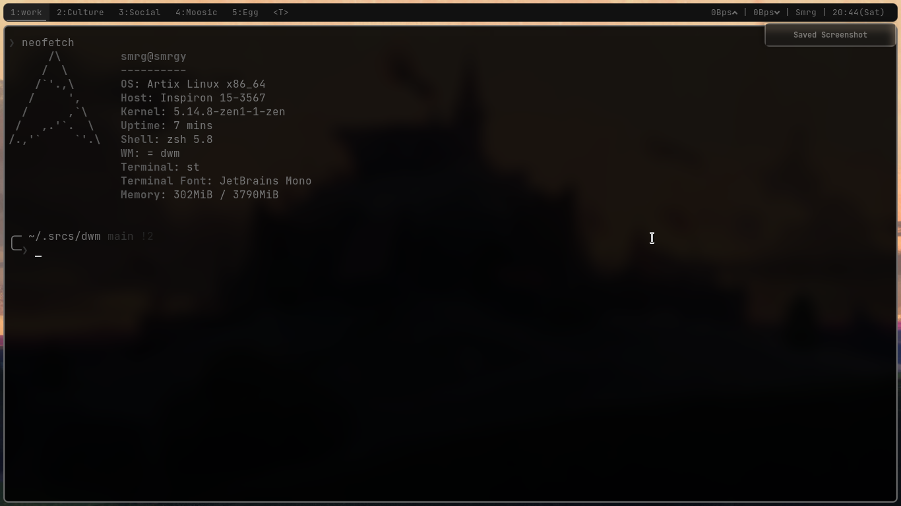

## Dwm. A window manager for X

Dwm is a simple dynamic window manager for X windowing system. <br>
You can install it with using 
```make clean install``` <br>

Also it can be auto install with the script to install my whole config [install.sh](https://github.com/AvishekPD/AvishekPD/blob/main/install.sh). <br> 

### KeyBinds 
For the keybinds you can look down the Pic below, 
<b>MOD key is set to MOD4</b> aka the windows key.

Feel free to modify and do what ever you want to do with this built of mine.

## Features 
- Not bloated, Yet.
- Simple with minimal patches.
- Gaps included.
- Dark themed easy for eyes.

<p alight="center">
	
</p>
